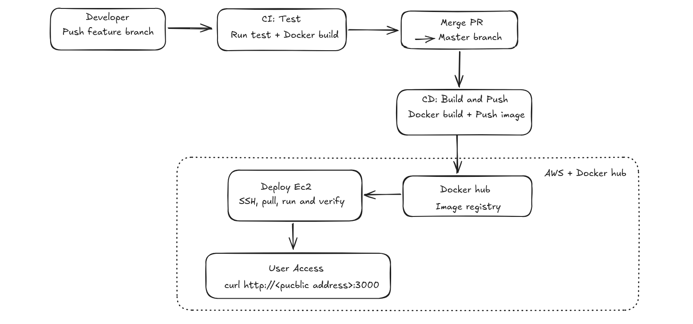
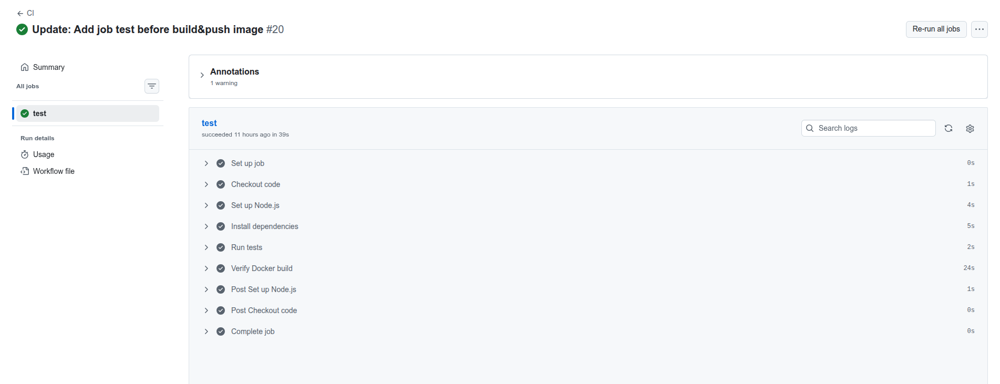
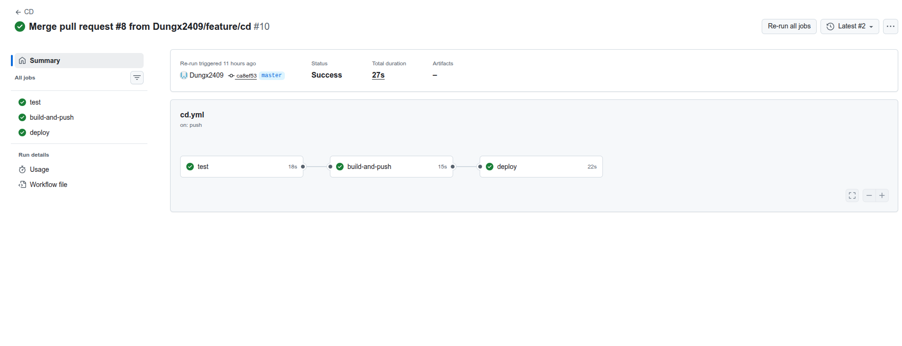
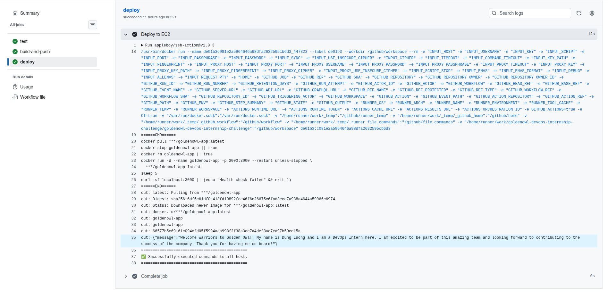
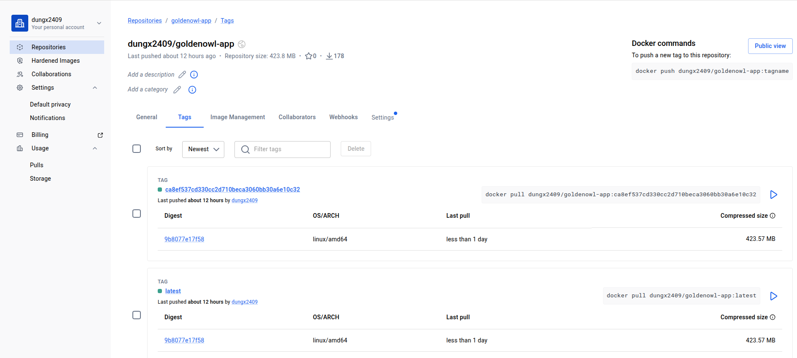
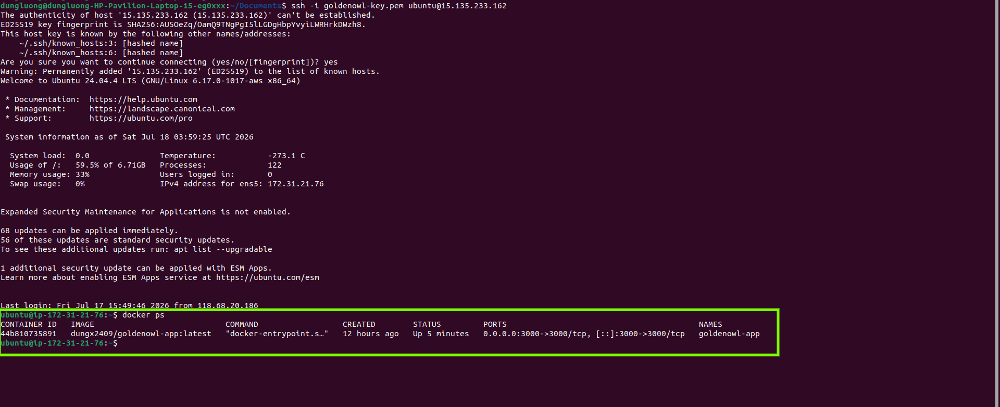
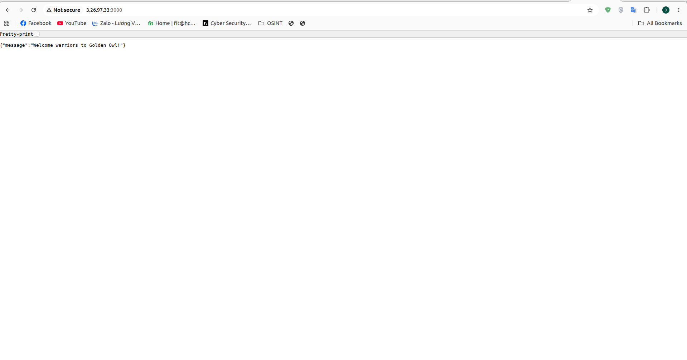
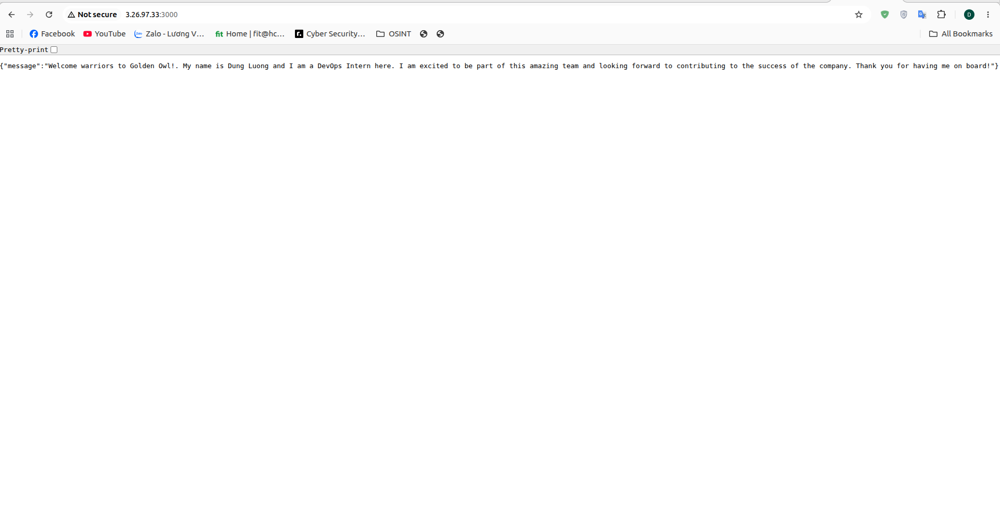

# Golden Owl DevOps Internship — Technical Test

Giải pháp CI/CD tự động hóa cho ứng dụng Node.js: dockerize, build/push image lên DockerHub, và deploy tự động lên AWS EC2 bằng GitHub Actions.

**🔗 Live demo:** http://15.135.233.162:3000/
**📦 Docker image:** [dungx2409/goldenowl-app](https://hub.docker.com/r/dungx2409/goldenowl-app)

```bash
curl http://15.135.233.162:3000/
# {"message":"Welcome warriors to Golden Owl!"}
```

---

## 1. Kiến trúc tổng quan

```
feature/xxx  --push-->  ci.yml (test)
     |
     PR --> merge vào master
     |
   master  --push-->  cd.yml
                         ├─ test          (gate lại lần nữa, phòng bypass)
                         ├─ build-and-push (build image từ src/, push DockerHub, tag latest + sha)
                         └─ deploy        (SSH EC2: pull → stop → rm → run → health check)
```

- **CI** (`ci.yml`): chạy khi push nhánh `feature/**` hoặc mở PR vào `master`. Chỉ làm 1 việc — verify code (test + build thử Docker image), không build/push/deploy gì cả.
- **CD** (`cd.yml`): chạy khi code vào `master`. Test lại → build & push image lên DockerHub → SSH vào EC2 để pull image mới nhất và restart container → verify bằng `curl`.
- **Branch protection**: `master` yêu cầu PR + status check `test` pass mới merge được, không cho push thẳng (kể cả admin).



---

## 2. Chạy ứng dụng local (không dùng Docker)

```bash
cd src
npm i
npm test
npm start
```

Test:
```bash
curl localhost:3000
# {"message":"Welcome warriors to Golden Owl!"}
```

---

## 3. Chạy bằng Docker

Dockerfile nằm trong `src/` (cùng cấp với `.dockerignore`, để build context loại trừ đúng `node_modules`, `.git`, `.env`, `.aws` theo file đó).

```bash
cd src
docker build -t goldenowl-app .
docker run -d -p 3000:3000 --name goldenowl-app goldenowl-app
curl localhost:3000
```

Dừng và dọn:
```bash
docker stop goldenowl-app && docker rm goldenowl-app
```

---

## 4. CI/CD Pipeline chi tiết

### 4.1. `ci.yml` — Continuous Integration

| Trigger | Việc làm |
|---|---|
| Push nhánh `feature/**` | Checkout → setup Node 20 → `npm ci` → `npm test` → `docker build` thử (không push) |
| Pull Request vào `master` | Chạy lại đúng như trên, làm status check bắt buộc trước khi merge |

### 4.2. `cd.yml` — Continuous Deployment

| Job | Việc làm |
|---|---|
| `test` | Chạy lại test suite — lớp phòng thủ thứ 2, phòng trường hợp branch protection bị tắt/bypass |
| `build-and-push` | Build Docker image từ `./src`, push lên DockerHub với 2 tag: `latest` (để deploy) và `<commit-sha>` (để rollback/audit) |
| `deploy` | SSH vào EC2, thực hiện deploy theo chiến lược **blue-green trên cùng 1 instance** kèm health check + rollback tự động |
 
#### Chi tiết bước `deploy` (blue-green + rollback)
 
Thay vì stop container cũ ngay rồi mới chạy container mới (có khoảng downtime và rủi ro nếu image mới lỗi), pipeline chạy song song 2 container tạm thời để verify trước khi "chuyển traffic":
 
1. **Dọn image cũ** : `docker image prune -f --filter "until=24h"`, tránh đầy ổ đĩa EC2 sau nhiều lần deploy.
2. **Pull image mới nhất** từ DockerHub (tag `latest`).
3. **Chạy container mới ở cổng tạm** `goldenowl-app-new` trên port **3001** (không đụng vào container production đang chạy ở port 3000), container cũ vẫn tiếp tục phục vụ user trong lúc này.
4. **Health check container mới** — retry `curl` tối đa 10 lần, mỗi lần cách nhau 3 giây, kiểm tra HTTP status `200`.
   - Nếu **fail toàn bộ 10 lần**: dừng + xóa container mới, `exit 1` → job đỏ, **container production cũ ở port 3000 không bị động tới**, app vẫn chạy bình thường cho user. Đây là cơ chế rollback tự động.
   - Nếu **pass**: chuyển sang bước 5.
5. **Switch traffic** — chỉ khi container mới đã xác nhận khỏe mạnh mới `stop` + `rm` container production cũ, rồi `run` container mới đè lên đúng port 3000 (tên `goldenowl-app`, `--restart unless-stopped`).
6. Dọn container tạm ở port 3001 (`goldenowl-app-new`), verify lần cuối bằng `curl` vào port 3000 chính thức.
**Lợi ích so với bản deploy trực tiếp (stop → run):** nếu image mới có bug khiến app crash hoặc không khởi động được, pipeline tự phát hiện ở bước 4 và **không bao giờ đưa image lỗi vào production** — người dùng luôn thấy phiên bản chạy ổn định cuối cùng, kể cả khi lần deploy đó fail.
 

### 4.3. GitHub Secrets cần cấu hình

`Settings → Secrets and variables → Actions`:

| Secret | Mô tả |
|---|---|
| `DOCKERHUB_USERNAME` | Username DockerHub |
| `DOCKERHUB_TOKEN` | Personal Access Token DockerHub (không dùng password) |
| `EC2_HOST` | Public IP của EC2 instance |
| `EC2_USER` | `ubuntu` |
| `EC2_SSH_KEY` | Nội dung private key `.pem` dùng SSH vào EC2 |

---

## 5. Hạ tầng AWS

- **EC2**: Ubuntu 22.04, `t3.micro`, security group mở port `22` và `3000` (HTTP app).
- **Docker** được cài sẵn trên instance qua `apt install docker.io`, user `ubuntu` thuộc group `docker`.
- Container chạy với `--restart unless-stopped` — tự khởi động lại nếu EC2 reboot.

*(Nếu đã làm phần Load Balancer / Auto Scaling, thêm mục dưới đây — xóa nếu không làm)*

## 6. Bằng chứng CI/CD chạy thành công

### 6.1. CI — test pass khi push nhánh feature / mở PR



### 6.2. CD — build, push image và deploy thành công


```
```

### 6.3. Image thực tế trên DockerHub




 Tag latest và tag theo commit sha được push đúng thời điểm CD chạy.
### 6.4. Instance EC2 đang chạy container



---

## 7. Bằng chứng cập nhật code phản ánh đúng trên môi trường live

Để chứng minh pipeline không chỉ "chạy xanh" mà thực sự đưa code mới lên server, đã thực hiện đổi nội dung response của API (ví dụ sửa message trả về ở `src/routes/`), sau đó đi qua đúng luồng: push nhánh feature → PR → merge `master` → CD tự deploy.

Screenshot trước khi update:

Screenshort sau khi update:


---

## 8. Cấu trúc thư mục

```
goldenowl-devops-internship-challenge/
├── .github/
│   └── workflows/
│       ├── ci.yml
│       └── cd.yml
├── src/
│   ├── routes/
│   ├── server/
│   ├── tests/
│   ├── Dockerfile
│   ├── package.json
│   └── ...
├── docs/
│   ├── architecture.png     # sơ đồ luồng CI/CD
│   ├── ci-success.png       # screenshot CI chạy pass
│   ├── cd-success.png       # screenshot CD chạy pass
│   ├── dockerhub.png        # screenshot image trên DockerHub
│   ├── ...
└── README.md
```

---

## 9. Ghi chú thiết kế

- Build context của Docker là `./src`, khớp vị trí `.dockerignore` thật trong repo, tránh leak `.env`/`.aws` vào image.
- Tag image theo `commit sha` bên cạnh `latest` để có thể rollback về đúng bản đã chạy production trước đó khi cần.
- Health check ở cuối bước deploy đảm bảo pipeline tự phát hiện nếu container start nhưng app crash ngay sau đó, không chỉ dựa vào exit code của `docker run`.
- Toàn bộ ảnh minh chứng nằm trong `docs/` để tách biệt khỏi mã nguồn `src/`, giữ repo gọn và dễ maintain.